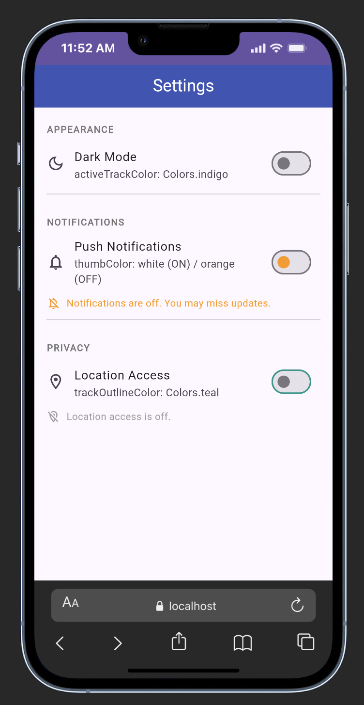
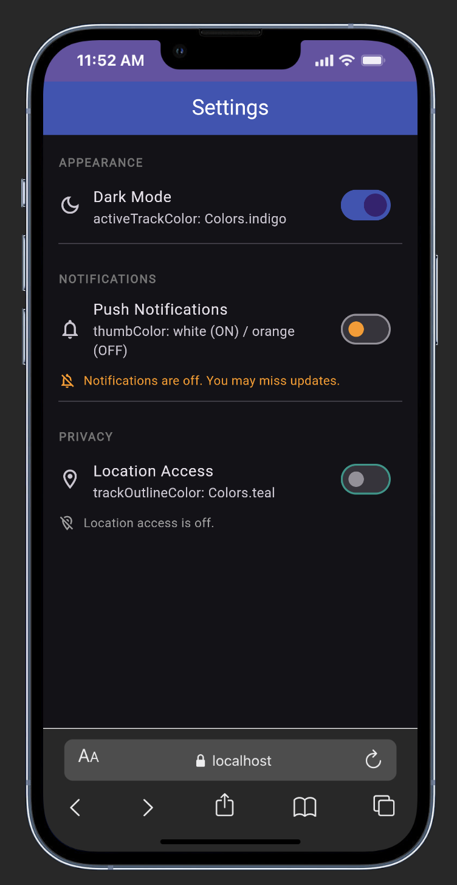
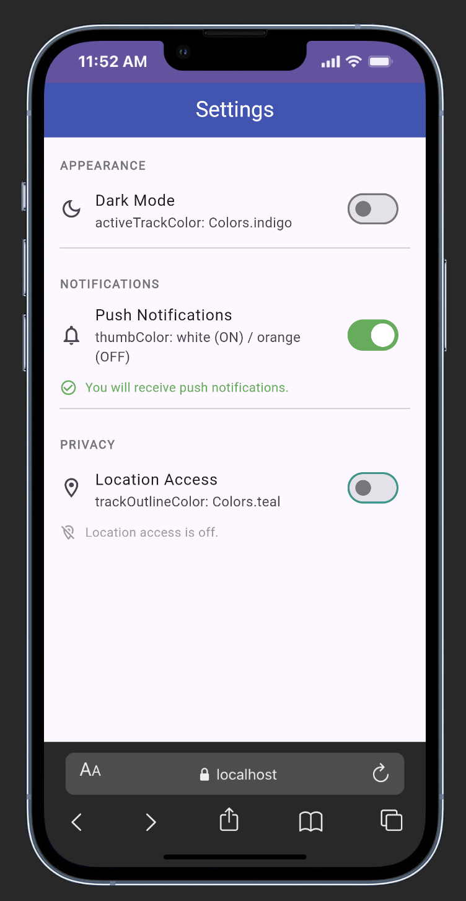
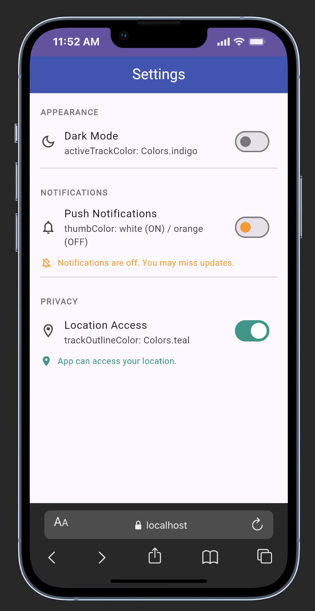

# flutter-switch-widget-demo

A Flutter widget that lets users toggle a boolean setting on or off — demonstrated through a realistic Settings screen with Dark Mode, Push Notifications, and Location Access toggles.

---

## Widget: Switch

The `Switch` widget is a Material Design toggle control. It represents a boolean value (`true`/`false`) and calls `onChanged` whenever the user flips it. It is commonly used in settings screens to let users enable or disable features without navigating away.

```dart
Switch(
  value: _isOn,
  onChanged: (val) => setState(() => _isOn = val),
)
```

---

## Screenshots

| All Off | Dark Mode On | Push Notifications On | Location Access On |
|---|---|---|---|
|  |  |  |  |

---

## Real-World Use Case

This demo mimics a typical **mobile app Settings screen** — one of the most common patterns in production apps (think iOS Settings, Android Settings, or apps like Spotify and Instagram). Each row uses a `Switch` to toggle a feature on or off and immediately shows feedback in the UI.

| Setting | Effect when toggled |
| --- | --- |
| Dark Mode | Switches the entire app between light and dark theme |
| Push Notifications | Shows a green confirmation or an orange warning message |
| Location Access | Shows a teal confirmation or a grey disabled message |

---

## Three Attributes Demonstrated

### 1. `activeTrackColor`

Controls the color of the **track** (the pill-shaped background) when the switch is **ON**.

```dart
Switch(
  value: _darkMode,
  activeTrackColor: Colors.indigo, // track turns indigo when ON
  onChanged: (val) => setState(() => _darkMode = val),
)
```

**Default:** Uses the theme's primary color.
**Why adjust it:** To match your app's brand color or distinguish between different types of toggles at a glance.

---

### 2. `thumbColor`

Controls the color of the **circular sliding dot** (the thumb). Accepts a `WidgetStateProperty` so you can set a different color depending on the switch state (ON vs OFF).

```dart
Switch(
  value: _notifications,
  thumbColor: WidgetStateProperty.resolveWith<Color>((states) {
    if (!states.contains(WidgetState.selected)) {
      return Colors.orange; // thumb is orange when OFF
    }
    return Colors.white;   // thumb is white when ON
  }),
  onChanged: (val) => setState(() => _notifications = val),
)
```

**Default:** White thumb when ON, grey thumb when OFF.
**Why adjust it:** To signal different states visually — for example, turning the thumb orange when a critical feature is disabled.

---

### 3. `trackOutlineColor`

Draws a **visible border** around the track in both ON and OFF states. Also accepts a `WidgetStateProperty` for per-state control.

```dart
Switch(
  value: _locationAccess,
  trackOutlineColor: WidgetStateProperty.all(Colors.teal),
  onChanged: (val) => setState(() => _locationAccess = val),
)
```

**Default:** No visible outline.
**Why adjust it:** Improves contrast on light or white backgrounds, which is important for accessibility (WCAG contrast compliance).

---

## How to Run

**Prerequisites:** Flutter 3.31+ installed and a connected device or emulator.

```bash
git clone https://github.com/<your-username>/flutter-switch-widget-demo.git
cd flutter-switch-widget-demo
flutter pub get
flutter run
```

---

## Project Structure

```text
lib/
└── main.dart        # All widget code — MyApp, SettingsScreen, _StatusCard, _SectionHeader
```

---

## Screenshot


---

## Sources

- Flutter official docs: [Switch class](https://api.flutter.dev/flutter/material/Switch-class.html)
- Material Design Switch guidelines: [M3 Switch overview](https://m3.material.io/components/switch/overview)
